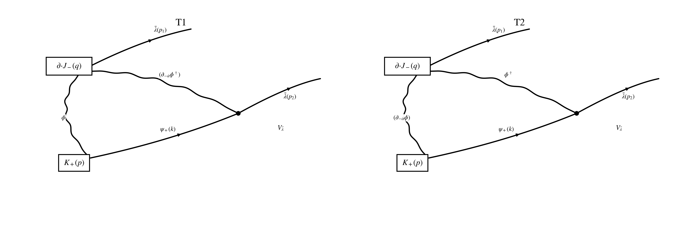

## Step 1: Operator / current / vertex

$$
K_+(p):=\frac{1}{\sqrt2}\int_k \psi_+(k)\,\phi^\dagger(p-k),
\qquad
U(1),\qquad
W=0.
$$

$$
J_-^a\supset iD(\sigma^a\bar\lambda)_-,
\qquad
D=-g\,\phi^\dagger\phi.
$$

$$
J_-^a\supset -ig\,\phi^\dagger\phi\,(\sigma^a\bar\lambda)_-.
$$

$$
\partial_aJ_-^a
=
-ig\,(\partial_{-\dot\alpha}\phi^\dagger)\phi\,\bar\lambda^{\dot\alpha}
-ig\,\phi^\dagger(\partial_{-\dot\alpha}\phi)\bar\lambda^{\dot\alpha}
-ig\,\phi^\dagger\phi\,\partial_{-\dot\alpha}\bar\lambda^{\dot\alpha}.
$$

$$
\partial_{-\dot\alpha}:=(\sigma^a)_{-\dot\alpha}\partial_a.
$$

$$
V_{\bar\lambda}
=
-\sqrt2\,g\int_z \bar\psi_{\dot\beta}(z)\,\bar\lambda^{\dot\beta}(z)\,\phi(z).
$$

$$
\langle \phi(k)\phi^\dagger(-k)\rangle=\frac1{k^2},
\qquad
\langle \psi_\alpha(k)\bar\psi_{\dot\beta}(-k)\rangle=\frac{k_{\alpha\dot\beta}}{k^2}.
$$

## Step 2: Wick contraction

$$
p+q=p_1+p_2.
$$

$$
T_1(q,p;p_1,p_2)
=
-g^2\,
\bar\lambda^{\dot\alpha}(p_1)\bar\lambda^{\dot\beta}(p_2)
\int_k
\frac{(k-p_2)_{-\dot\alpha}\,k_{+\dot\beta}}
{k^2\,(k-p_2)^2\,(p-k)^2}.
$$

$$
T_2(q,p;p_1,p_2)
=
g^2\,
\bar\lambda^{\dot\alpha}(p_1)\bar\lambda^{\dot\beta}(p_2)
\int_k
\frac{(p-k)_{-\dot\alpha}\,k_{+\dot\beta}}
{k^2\,(k-p_2)^2\,(p-k)^2}.
$$

$$
T_3(q,p;p_1,p_2)
\propto
p_{1,-\dot\alpha}\,
\bar\lambda^{\dot\alpha}(p_1)\bar\lambda^{\dot\beta}(p_2)
\int_k
\frac{k_{+\dot\beta}}
{k^2\,(k-p_2)^2\,(p-k)^2}.
$$

$$
T_3\Big|_{\rm anomaly\ sector}=0.
$$

$$
T_1+T_2
=
g^2\,(p-p_2)_{-\dot\alpha}\,
\bar\lambda^{\dot\alpha}(p_1)\bar\lambda^{\dot\beta}(p_2)
\int_k
\frac{k_{+\dot\beta}}
{k^2\,(k-p_2)^2\,(p-k)^2}.
$$

$$
p-p_2=q-p_1.
$$

## Step 3: Local part = Taylor subtraction

$$
t^0_{p,q,p_1,p_2}T_1
=
-g^2\,
\bar\lambda^{\dot\alpha}\bar\lambda^{\dot\beta}
\int_k
\frac{k_{-\dot\alpha}k_{+\dot\beta}}{(k^2)^3},
$$

$$
t^0_{p,q,p_1,p_2}T_2
=
-g^2\,
\bar\lambda^{\dot\alpha}\bar\lambda^{\dot\beta}
\int_k
\frac{k_{-\dot\alpha}k_{+\dot\beta}}{(k^2)^3},
$$

$$
t^0(T_1+T_2)
=
-2g^2\,
\bar\lambda^{\dot\alpha}\bar\lambda^{\dot\beta}
\int_k
\frac{k_{-\dot\alpha}k_{+\dot\beta}}{(k^2)^3}.
$$

$$
\bar\lambda^{\dot\alpha}\bar\lambda^{\dot\beta}
=
\frac12\,\epsilon^{\dot\alpha\dot\beta}\,\bar\lambda^2,
\qquad
\bar\lambda^2:=\bar\lambda_{\dot\gamma}\bar\lambda^{\dot\gamma}.
$$

$$
t^0(T_1+T_2)
=
-2g^2\,\bar\lambda^2
\int_k \frac{\bar k^2}{(k^2)^3}.
$$

$$
\text{classical / formal-4d collapse}
=
-2g^2\,\bar\lambda^2\int_k \frac{k^2}{(k^2)^3}
=
-2g^2\,\bar\lambda^2\int_k \frac1{(k^2)^2}.
$$

$$
\Gamma_{\rm anom}^{\rm loc}
=
-2g^2\,\bar\lambda^2
\int_k \frac{\widehat k^2}{(k^2)^3}.
$$

## Step 4: DR integral

$$
I_{\widehat k}:=
\mu^{2\varepsilon}\int\frac{d^d k}{(2\pi)^d}\frac{\widehat k^2}{(k^2)^3}.
$$

$$
I_{\widehat k}
=
-\frac{2\varepsilon}{4-2\varepsilon}
\mu^{2\varepsilon}\int\frac{d^d k}{(2\pi)^d}\frac1{(k^2)^2}.
$$

$$
\mu^{2\varepsilon}\int\frac{d^d k}{(2\pi)^d}\frac1{(k^2)^2}
=
\frac{\Gamma(\varepsilon)}{(4\pi)^{2-\varepsilon}}.
$$

$$
I_{\widehat k}
=
-\frac{2\varepsilon}{4-2\varepsilon}
\frac{\Gamma(\varepsilon)}{(4\pi)^{2-\varepsilon}}.
$$

$$
\Gamma(\varepsilon)=\frac1\varepsilon+O(1).
$$

$$
\boxed{
I_{\widehat k}=-\frac1{32\pi^2}.
}
$$

## Step 5: Final local anomaly

$$
\Gamma_{\rm anom}^{\rm loc}(q,p)
=
-2g^2\,\bar\lambda^2\Big(-\frac1{32\pi^2}\Big).
$$

$$
\boxed{
\Gamma_{\rm anom}^{\rm loc}(q,p)
=
\frac{g^2}{16\pi^2}\,\bar\lambda^2(p+q).
}
$$

$$
q\to0:
\qquad
\boxed{
Q_-^{\rm Loop}
\left(\frac1{\sqrt2}\psi_+\phi^\dagger\right)(p)
=
\frac{g^2}{16\pi^2}\,\bar\lambda^2(p).
}
$$

$$
\boxed{
Q_-^{\rm Loop}(\psi_+\phi^\dagger)(p)
=
\frac{\sqrt2\,g^2}{16\pi^2}\,\bar\lambda^2(p).
}
$$

$$
\boxed{
Q_-^{\rm Loop}
\left(\frac1{\sqrt2}\psi_+\phi^\dagger\right)(x)
=
\frac{g^2}{16\pi^2}\,\bar\lambda^2(x).
}
$$

$$
\boxed{
\text{anomaly sector}
=
t^0(T_1+T_2)
\;-\;
\text{classical / formal-4d collapse}.
}
$$
