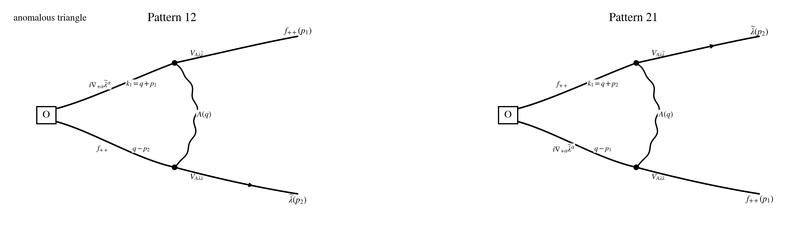

## Step 1: Operator / current / vertex

$$
\boxed{Q_1\equiv Q_-}.
$$

$$
\boxed{\text{same }Q_-\text{ as in }conventions\_and\_rules.md;\ \text{parent }N=4\text{ notation: }Q_-^4.}
$$

$$
\delta_{Q_1}=\delta_{Q_-},
\qquad
J^\mu_{Q_1}=J^\mu_-,
\qquad
\partial_\mu J^\mu_{Q_1}=\partial_\mu J^\mu_-.
$$

$$
\mathcal O_{ff}^{AB}(p):=\int_{p_1,p_2}f_{++}^A(p_1)f_{++}^B(p_2)\,\delta_{p-p_1-p_2},
\qquad
p=p_1+p_2.
$$

$$
J^\mu_-:=v_-^\alpha J^\mu_\alpha,
\qquad
J_{\mu\alpha}^{\rm rel}=-\frac{c_f}{2g_0}\,f_{\alpha\beta}^C(\sigma_\mu)^{\beta\dot\beta}\bar\lambda_{\dot\beta}^C.
$$

$$
\partial_\mu J^\mu_-(x)\cdot \mathcal O_{ff}^{AB}(y).
$$

$$
\mathcal I[f_{++}^a(p)]
=
\mathcal I^{(1)}[f_{++}^a(p)]
+\mathcal I^{(2)}[f_{++}^a(p)].
$$

$$
\mathcal I^{(1)}[f_{++}^a(p)]
=
\frac{i}{2}\big(p_{+\dot+}A_{+\dot-}^a(p)-p_{+\dot-}A_{+\dot+}^a(p)\big).
$$

$$
\mathcal I^{(2)}[f_{++}^a(p)]
=
\frac{g}{2}f^{abc}\int_q A_{+\dot+}^b(q)A_{+\dot-}^c(p-q).
$$

$$
J^\mu_-
=
J^{\mu,(2)}_-+J^{\mu,(3)}_-,
\qquad
J^{(2)}_-\sim (\partial A)\bar\lambda,
\qquad
J^{(3)}_-\sim [A,A]\bar\lambda.
$$

$$
\langle f_{++}^a(p)A_{-\dot\alpha}^b(-p)\rangle=-\frac{i\delta^{ab}p_{+\dot\alpha}}{p^2},
\qquad
\langle \lambda_\alpha^a(p)\bar\lambda_{\dot\beta}^b(-p)\rangle=-\frac{i\delta^{ab}p_{\alpha\dot\beta}}{p^2}.
$$

$$
\langle f_{++}(x)f_{++}(y)\rangle_0=0,
\qquad
\langle f_{+-}(x)f_{++}(y)\rangle_0=0,
\qquad
\langle f_{--}(x)f_{++}(y)\rangle_0=2K(x-y).
$$

$$
\text{only the }f_{--}\Xi^{\mu -}\text{ branch of }J^\mu_-\text{ feeds into the external }f_{++}\text{ leg}.
$$

## Step 2: Wick contraction

$$
\big\langle \partial_\mu J^\mu_-(x)\,\mathcal O_{ff}^{AB}(y)\big\rangle_{\rm conn,loc}
=
T_{\rm lin-lin}^{AB}(x,y)
+T_{\rm lin-quad}^{AB}(x,y)
+T_{\rm quad-lin}^{AB}(x,y).
$$

$$
T_{\rm lin-lin}^{AB}(x,y)
\Longrightarrow
\delta^{(4)}(x-y)\,
\Big[
i\,\partial_{+\dot\beta}\bar\lambda^{A\dot\beta}\,f_{++}^B
+f_{++}^A\,i\,\partial_{+\dot\beta}\bar\lambda^{B\dot\beta}
\Big](y).
$$

$$
T_{\rm lin-quad}^{AB}(x,y)
\Longrightarrow
\delta^{(4)}(x-y)\,
\Big[
\frac{i}{2}[A_{+\dot\beta},\bar\lambda^{\dot\beta}]^A\,f_{++}^B
+f_{++}^A\,\frac{i}{2}[A_{+\dot\beta},\bar\lambda^{\dot\beta}]^B
\Big](y).
$$

$$
T_{\rm quad-lin}^{AB}(x,y)
\Longrightarrow
\delta^{(4)}(x-y)\,
\Big[
\frac{i}{2}[A_{+\dot\beta},\bar\lambda^{\dot\beta}]^A\,f_{++}^B
+f_{++}^A\,\frac{i}{2}[A_{+\dot\beta},\bar\lambda^{\dot\beta}]^B
\Big](y).
$$

## Step 3: Local WT contact reconstruction

$$
T_{\rm lin-lin}^{AB}
+T_{\rm lin-quad}^{AB}
+T_{\rm quad-lin}^{AB}
\Longrightarrow
\delta^{(4)}(x-y)\,
\Big[
iD_{+\dot\beta}\bar\lambda^{A\dot\beta}\,f_{++}^B
+f_{++}^A\,iD_{+\dot\beta}\bar\lambda^{B\dot\beta}
\Big](y).
$$

$$
\delta_{Q_-}^{\rm cl}f_{++}^A
=
iD_{+\dot\beta}\bar\lambda^{A\dot\beta}.
$$

$$
\big\langle \partial_\mu J^\mu_-(x)\,\mathcal O_{ff}^{AB}(y)\big\rangle_{\rm conn,loc}
\Longrightarrow
\delta^{(4)}(x-y)\,
\delta_{Q_-}^{\rm cl}\mathcal O_{ff}^{AB}(y).
$$

$$
t^0(\cdots)=\Gamma_{\rm cl}.
$$

## Step 4: Regularization and consistency condition

$$
\big\langle \partial_\mu J^\mu_-(x)\,\mathcal O_{ff}^{AB}(y)\big\rangle_{\rm DR,loc}
=
\delta^{(4)}(x-y)\,
\delta_{Q_-}^{\rm cl}\mathcal O_{ff}^{AB}(y).
$$

$$
t^0(\cdots)-\Gamma_{\rm cl}=0.
$$

$$
\delta_{Q_-}^{\rm cl}\mathcal O_{ff}^{AB}(x)
=
\big(iD_{+\dot\beta}\bar\lambda^{A\dot\beta}\big)f_{++}^B
+f_{++}^A\big(iD_{+\dot\beta}\bar\lambda^{B\dot\beta}\big).
$$

$$
\boxed{
\text{no new pure-SYM gauge-invariant local remainder in the }\partial_\mu J^\mu_-\text{ channel}
}.
$$

## Step 5: Simplification examples

$$
\big\langle \partial_\mu J^\mu_-(x)\,\operatorname{Tr}(f_{++}f_{++})(y)\big\rangle_{\rm conn,loc}
\Longrightarrow
2\,\delta^{(4)}(x-y)\,
\operatorname{Tr}\!\big((Q_-^{\rm cl}f_{++})f_{++}\big)(y).
$$

$$
\delta_{Q_-}^{\rm cl}\operatorname{Tr}(f_{++}f_{++})
=
2\,\operatorname{Tr}\!\big((Q_-^{\rm cl}f_{++})f_{++}\big).
$$

$$
t^0(\cdots)-\Gamma_{\rm cl}=0.
$$
