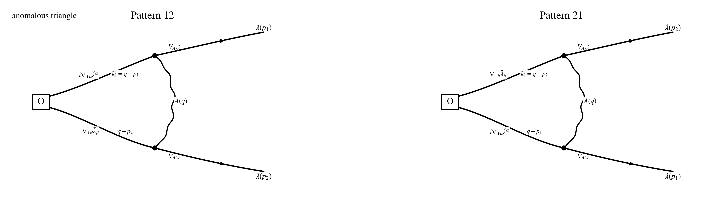

## Step 1: Operator / current / vertex

$$
\mathcal O_{\dot\theta\dot\beta}^{AB}(p)
:=
\int_{p_1,p_2}
f_{++}^A(p_1)\,
\nabla_{+\dot\theta}\bar\lambda_{\dot\beta}^B(p_2)\,
\delta_{p-p_1-p_2}.
$$

$$
p=p_1+p_2.
$$

## Step 2: Wick contraction

$$
\mathcal I\!\left[Q_1\mathcal O_{\dot\theta\dot\beta}^{AB}(p)\right]_{\rm PV,\,1\text{-}loop,\,loc}
=
\Gamma_{12,\dot\theta\dot\beta}^{AB}(p)
+
\Gamma_{21,\dot\theta\dot\beta}^{AB}(p).
$$

## Step 3: Local part

$$
\Gamma_{12;M}^{\rm PV\text{-}loop}{}_{\dot\theta\dot\beta}
=
2i g^2\int_q
\frac{(q-p_2)_{+\dot\theta}(q-p_2)_{+\dot\beta}}
{(q^2+M^2)\big((q-p_2)^2+M^2\big)}\,
\mathscr C_{12}
$$

$$
\qquad
-2i g^2M^2\int_q
\frac{(q-p_2)_{+\dot\theta}(q-p_2)_{+\dot\beta}}
{(q^2+M^2)\big((q+p_1)^2+M^2\big)\big((q-p_2)^2+M^2\big)}\,
\mathscr C_{12},
$$

$$
\Gamma_{21;M}^{\rm PV\text{-}loop}{}_{\dot\theta\dot\beta}
=
2i g^2\int_q
\frac{(q-p_1)_{+\dot\theta}(q-p_1)_{+\dot\beta}}
{(q^2+M^2)\big((q-p_1)^2+M^2\big)}\,
\mathscr C_{21}
$$

$$
\qquad
-2i g^2M^2\int_q
\frac{(q-p_1)_{+\dot\theta}(q-p_1)_{+\dot\beta}}
{(q^2+M^2)\big((q+p_2)^2+M^2\big)\big((q-p_1)^2+M^2\big)}\,
\mathscr C_{21}.
$$

## Step 4: Regularization and final local anomaly

$$
\frac{1}{(q^2+M^2)\big((q+p_1)^2+M^2\big)\big((q-p_2)^2+M^2\big)}
=
2\int_\Delta
\frac{1}{\big[(q+y p_1-z p_2)^2+M^2+\Delta\big]^3},
$$

$$
\ell=q+y p_1-z p_2,
\qquad
q-p_2=\ell-y p-x p_2.
$$

$$
\Xi_{12,+\dot\theta,+\dot\beta}(p_1,p_2)
:=
p_{1,+\dot\theta}p_{1,+\dot\beta}
+
3p_{1,+(\dot\theta}p_{2,+\dot\beta)}
+
3p_{2,+\dot\theta}p_{2,+\dot\beta},
$$

$$
\Xi_{21,+\dot\theta,+\dot\beta}(p_1,p_2)
:=
3p_{1,+\dot\theta}p_{1,+\dot\beta}
+
3p_{1,+(\dot\theta}p_{2,+\dot\beta)}
+
p_{2,+\dot\theta}p_{2,+\dot\beta}.
$$

$$
\Gamma_{12}^{({\rm anom,loc})}{}_{\dot\theta\dot\beta}
=
-\frac{i g^2}{96\pi^2}\,
\Xi_{12,+\dot\theta,+\dot\beta}(p_1,p_2)\,
\mathscr C_{12},
$$

$$
\Gamma_{21}^{({\rm anom,loc})}{}_{\dot\theta\dot\beta}
=
-\frac{i g^2}{96\pi^2}\,
\Xi_{21,+\dot\theta,+\dot\beta}(p_1,p_2)\,
\mathscr C_{21}.
$$

$$
\boxed{
\mathcal I\!\left[Q_1\mathcal O_{\dot\theta\dot\beta}^{AB}(p)\right]_{\rm PV,\,1\text{-}loop,\,loc}
=
-\frac{i g^2}{96\pi^2}
\int_{p_1,p_2}\delta_{p-p_1-p_2}
\Big[
\Xi_{12,+\dot\theta,+\dot\beta}\,\mathscr C_{12}^{AB}
+
\Xi_{21,+\dot\theta,+\dot\beta}\,\mathscr C_{21}^{AB}
\Big].
}
$$

## Step 5: Simplification examples

$$
\mathscr C_{12}^{AB}(p_1,p_2)
=
\epsilon^{\dot\gamma\dot\delta}
f^{CA}{}_{E}f^{DB}{}_{E}\,
\bar\lambda_{\dot\gamma}^{C}(p_1)\,
\bar\lambda_{\dot\delta}^{D}(p_2),
\qquad
\mathscr C_{21}^{AB}(p_1,p_2)=\mathscr C_{12}^{AB}(p_2,p_1).
$$

$$
\mathcal B_{\dot\theta\dot\beta}^{AB}(x)
:=
\epsilon^{\dot\gamma\dot\delta}
f^{CA}{}_{E}f^{DB}{}_{E}
\Big[
(\nabla_{+(\dot\theta}\nabla_{+\dot\beta)}\bar\lambda_{\dot\gamma}^{C})\bar\lambda_{\dot\delta}^{D}
+
3(\nabla_{+(\dot\theta}\bar\lambda_{\dot\gamma}^{C})(\nabla_{+\dot\beta)}\bar\lambda_{\dot\delta}^{D})
+
3\bar\lambda_{\dot\gamma}^{C}(\nabla_{+(\dot\theta}\nabla_{+\dot\beta)}\bar\lambda_{\dot\delta}^{D})
\Big],
$$

$$
\boxed{
Q_1\mathcal O_{\dot\theta\dot\beta}^{AB}(x)\Big|_{\rm PV,\,1\text{-}loop,\,loc}
=
\frac{i g^2}{48\pi^2}\,
\mathcal B_{\dot\theta\dot\beta}^{AB}(x).
}
$$
