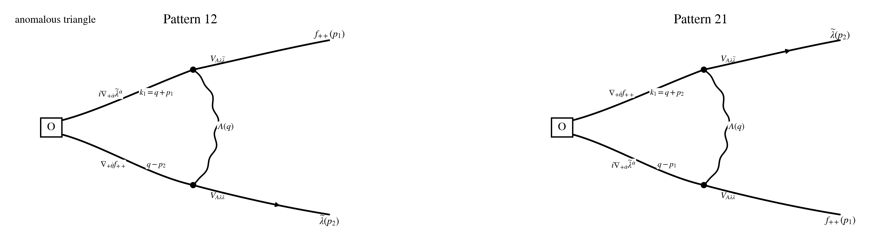

## Step 1: Operator / current / vertex

$$
\boxed{Q_1\equiv Q_-}.
$$

$$
\boxed{\text{same }Q_-\text{ as in }conventions\_and\_rules.md;\ \text{parent }N=4\text{ notation: }Q_-^4.}
$$

$$
\delta_{Q_1}=\delta_{Q_-},
\qquad
J^\mu_{Q_1}=J^\mu_-,
\qquad
\partial_\mu J^\mu_{Q_1}=\partial_\mu J^\mu_-.
$$

$$
\mathcal O_{\dot\theta}^{AB}(p)
:=
\int_{p_1,p_2}
f_{++}^A(p_1)\,
\nabla_{+\dot\theta}f_{++}^B(p_2)\,
\delta_{p-p_1-p_2}.
$$

$$
p=p_1+p_2.
$$

$$
\mathcal O_{\dot\theta}^{\rm mix}
:=
\big(i\nabla_{+\dot\alpha}\widetilde\lambda^{\dot\alpha}\big)\,
\nabla_{+\dot\theta}f_{++}.
$$

## Step 2: Wick contraction

$$
\mathcal I\!\left[Q_1\mathcal O_{\dot\theta}^{AB}(p)\right]_{\rm PV,\,1\text{-}loop,\,loc}
=
\Gamma_{12,\dot\theta}^{AB}(p)
+
\Gamma_{21,\dot\theta}^{AB}(p).
$$

## Step 3: Local part

$$
\Gamma_{12;M}^{\rm PV\text{-}loop}{}_{\dot\theta}
=
2i g^2\int_q
\frac{(q-p_2)_{+\dot\theta}(q-p_2)_{+\dot\beta}}
{(q^2+M^2)\big((q-p_2)^2+M^2\big)}\,
\mathscr F_{12}^{\dot\beta}
$$

$$
\qquad
-2i g^2M^2\int_q
\frac{(q-p_2)_{+\dot\theta}(q-p_2)_{+\dot\beta}}
{(q^2+M^2)\big((q+p_1)^2+M^2\big)\big((q-p_2)^2+M^2\big)}\,
\mathscr F_{12}^{\dot\beta},
$$

$$
\Gamma_{21;M}^{\rm PV\text{-}loop}{}_{\dot\theta}
=
2i g^2\int_q
\frac{(q-p_1)_{+\dot\theta}(q-p_1)_{+\dot\beta}}
{(q^2+M^2)\big((q-p_1)^2+M^2\big)}\,
\mathscr F_{21}^{\dot\beta}
$$

$$
\qquad
-2i g^2M^2\int_q
\frac{(q-p_1)_{+\dot\theta}(q-p_1)_{+\dot\beta}}
{(q^2+M^2)\big((q+p_2)^2+M^2\big)\big((q-p_1)^2+M^2\big)}\,
\mathscr F_{21}^{\dot\beta}.
$$

## Step 4: Regularization and final local anomaly

$$
\ell=q+y p_1-z p_2,
\qquad
q-p_2=\ell-y p-x p_2.
$$

$$
\Xi_{12,+\dot\theta,+\dot\beta}(p_1,p_2)
:=
p_{1,+\dot\theta}p_{1,+\dot\beta}
+
3p_{1,+(\dot\theta}p_{2,+\dot\beta)}
+
3p_{2,+\dot\theta}p_{2,+\dot\beta},
$$

$$
\Xi_{21,+\dot\theta,+\dot\beta}(p_1,p_2)
:=
3p_{1,+\dot\theta}p_{1,+\dot\beta}
+
3p_{1,+(\dot\theta}p_{2,+\dot\beta)}
+
p_{2,+\dot\theta}p_{2,+\dot\beta}.
$$

$$
\Gamma_{12}^{({\rm anom,loc})}{}_{\dot\theta}
=
-\frac{i g^2}{96\pi^2}\,
\Xi_{12,+\dot\theta,+\dot\beta}(p_1,p_2)\,
\mathscr F_{12}^{\dot\beta},
$$

$$
\Gamma_{21}^{({\rm anom,loc})}{}_{\dot\theta}
=
-\frac{i g^2}{96\pi^2}\,
\Xi_{21,+\dot\theta,+\dot\beta}(p_1,p_2)\,
\mathscr F_{21}^{\dot\beta}.
$$

$$
\boxed{
\mathcal I\!\left[\mathcal O_{\dot\theta}^{\rm mix}(p)\right]_{\rm PV,\,1\text{-}loop,\,loc}
=
-\frac{i g^2}{96\pi^2}
\int_{p_1,p_2}\delta_{p-p_1-p_2}
\Big[
\Xi_{12,+\dot\theta,+\dot\beta}\,\mathscr F_{12}^{\dot\beta}
+
\Xi_{21,+\dot\theta,+\dot\beta}\,\mathscr F_{21}^{\dot\beta}
\Big].
}
$$

$$
\boxed{
\mathcal I\!\left[Q_1\mathcal O_{\dot\theta}^{AB}(p)\right]_{\rm PV,\,1\text{-}loop,\,loc}
=
-\frac{i g^2}{48\pi^2}
\int_{p_1,p_2}\delta_{p-p_1-p_2}\,
p_{+\dot\theta}
\Big[
(p_1+2p_2)_{+\dot\beta}\,\mathscr F_{12}^{AB,\dot\beta}
+
(2p_1+p_2)_{+\dot\beta}\,\mathscr F_{21}^{AB,\dot\beta}
\Big].
}
$$

## Step 5: Simplification examples

$$
\mathscr F_{21}^{AB,\dot\beta}(p_1,p_2)=\mathscr F_{12}^{AB,\dot\beta}(p_2,p_1).
$$
