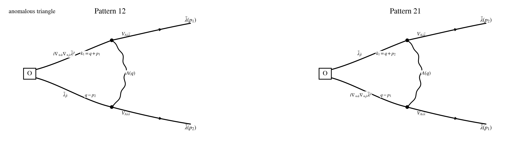

## Step 1: Operator / current / vertex

$$
\boxed{Q_1\equiv Q_-}.
$$

$$
\boxed{\text{same }Q_-\text{ as in }conventions\_and\_rules.md;\ \text{parent }N=4\text{ notation: }Q_-^4.}
$$

$$
\delta_{Q_1}=\delta_{Q_-},
\qquad
J^\mu_{Q_1}=J^\mu_-,
\qquad
\partial_\mu J^\mu_{Q_1}=\partial_\mu J^\mu_-.
$$

$$
\mathcal O_{\dot\alpha\dot\beta}^{AB}(p)
:=
\int_{p_1,p_2}
\big(\nabla_{+\dot\alpha}f_{++}^A\big)(p_1)\,
\bar\lambda_{\dot\beta}^B(p_2)\,
\delta_{p-p_1-p_2}.
$$

$$
Q_-\bar\lambda_{\dot\beta}^B=0.
$$

$$
\big[\delta_{Q_-}^{\rm cl}\mathcal O_{\dot\alpha\dot\beta}^{AB}\big]_{f_{++}\text{-active}}
=
\big(\delta_{Q_-}^{\rm cl}\nabla_{+\dot\alpha}f_{++}^A\big)\,
\bar\lambda_{\dot\beta}^B.
$$

$$
J^\mu_-=J^{\mu,(2)}_-+J^{\mu,(3)}_-,
\qquad
J^{(2)}_-\sim (\partial A)\bar\lambda,
\qquad
J^{(3)}_-\sim [A,A]\bar\lambda.
$$

$$
\langle f_{++}(x)f_{++}(y)\rangle_0=0,
\qquad
\langle f_{+-}(x)f_{++}(y)\rangle_0=0,
\qquad
\langle f_{--}(x)f_{++}(y)\rangle_0=2K(x-y).
$$

## Step 2: Wick contraction

$$
\big\langle \partial_\mu J^\mu_-(x)\,\mathcal O_{\dot\alpha\dot\beta}^{AB}(y)\big\rangle_{\rm conn,loc}
=
T_{\rm lin-lin,\dot\alpha\dot\beta}^{AB}(x,y)
+T_{\rm lin-quad,\dot\alpha\dot\beta}^{AB}(x,y)
+T_{\rm quad-lin,\dot\alpha\dot\beta}^{AB}(x,y).
$$

$$
T_{\rm lin-lin,\dot\alpha\dot\beta}^{AB}(x,y)
\Longrightarrow
\delta^{(4)}(x-y)\,
\big[\delta_{Q_-}^{\rm cl}\mathcal O_{\dot\alpha\dot\beta}^{AB}(y)\big]^{(\partial\bar\lambda)}_{f_{++}\text{-active}}.
$$

$$
T_{\rm lin-quad,\dot\alpha\dot\beta}^{AB}(x,y)
\Longrightarrow
\delta^{(4)}(x-y)\,
\big[\delta_{Q_-}^{\rm cl}\mathcal O_{\dot\alpha\dot\beta}^{AB}(y)\big]^{([A,\bar\lambda])}_{f_{++}\text{-active}}.
$$

$$
T_{\rm quad-lin,\dot\alpha\dot\beta}^{AB}(x,y)
\Longrightarrow
\delta^{(4)}(x-y)\,
\big[\delta_{Q_-}^{\rm cl}\mathcal O_{\dot\alpha\dot\beta}^{AB}(y)\big]^{([A,\bar\lambda])}_{f_{++}\text{-active}}.
$$

## Step 3: WT contact reconstruction

$$
T_{\rm lin-lin,\dot\alpha\dot\beta}^{AB}
+T_{\rm lin-quad,\dot\alpha\dot\beta}^{AB}
+T_{\rm quad-lin,\dot\alpha\dot\beta}^{AB}
\Longrightarrow
\delta^{(4)}(x-y)\,
\big[\delta_{Q_-}^{\rm cl}\mathcal O_{\dot\alpha\dot\beta}^{AB}(y)\big]_{f_{++}\text{-active}}.
$$

$$
t^0(\cdots)=\Gamma_{\rm cl}.
$$

## Step 4: Regularization and consistency condition

$$
\big\langle \partial_\mu J^\mu_-(x)\,\mathcal O_{\dot\alpha\dot\beta}^{AB}(y)\big\rangle_{\rm PV,loc}
=
\delta^{(4)}(x-y)\,
\big[\delta_{Q_-}^{\rm cl}\mathcal O_{\dot\alpha\dot\beta}^{AB}(y)\big]_{f_{++}\text{-active}}.
$$

$$
t^0(\cdots)-\Gamma_{\rm cl}=0.
$$

$$
\boxed{
\text{no new pure-SYM gauge-invariant local remainder in the }\partial_\mu J^\mu_-\text{ channel}
}.
$$

## Step 5: Simplification examples

$$
\big\langle \partial_\mu J^\mu_-(x)\,\operatorname{Tr}\!\big((\nabla_{+\dot\alpha}f_{++})\bar\lambda_{\dot\beta}\big)(y)\big\rangle_{\rm conn,loc}
\Longrightarrow
\delta^{(4)}(x-y)\,
\big[\delta_{Q_-}^{\rm cl}\operatorname{Tr}\!\big((\nabla_{+\dot\alpha}f_{++})\bar\lambda_{\dot\beta}\big)(y)\big]_{f_{++}\text{-active}}.
$$

$$
t^0(\cdots)-\Gamma_{\rm cl}=0.
$$
