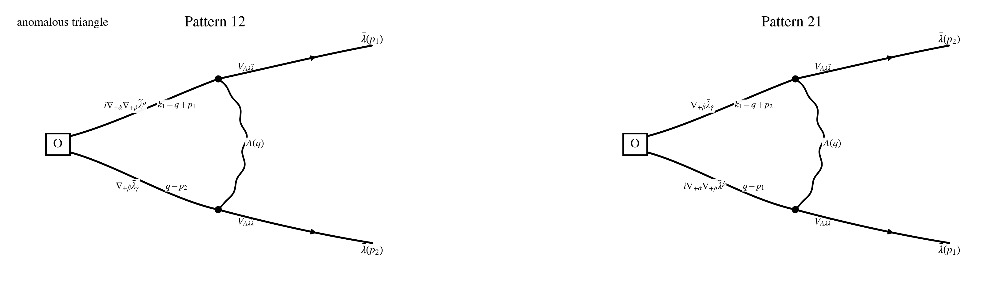

## Step 1: Operator / current / vertex

$$
\boxed{Q_1\equiv Q_-}.
$$

$$
\boxed{\text{same }Q_-\text{ as in }conventions\_and\_rules.md;\ \text{parent }N=4\text{ notation: }Q_-^4.}
$$

$$
\delta_{Q_1}=\delta_{Q_-},
\qquad
J^\mu_{Q_1}=J^\mu_-,
\qquad
\partial_\mu J^\mu_{Q_1}=\partial_\mu J^\mu_-.
$$

$$
\kappa_A=\frac{i}{2},
\qquad
\delta_{Q_-}^{\rm cl}A_{+\dot\alpha}=\kappa_A\,\bar\lambda_{\dot\alpha},
\qquad
\delta_{Q_-}^{\rm cl}\bar\lambda_{\dot\alpha}=0.
$$

$$
\mathcal O_{\dot\alpha\dot\beta\dot\gamma}^{AB}(p)
:=
\int_{p_1,p_2}
\big(\nabla_{+\dot\alpha}f_{++}^A\big)(p_1)\,
\big(\nabla_{+\dot\beta}\bar\lambda_{\dot\gamma}^B\big)(p_2)\,
\delta_{p-p_1-p_2}.
$$

$$
\delta_{Q_-}^{\rm cl}(\nabla_{+\dot\alpha}f_{++}^A)
=
2\kappa_A\,\nabla_{+\dot\alpha}\nabla_{+\dot\theta}\bar\lambda^{A\dot\theta}
+
\kappa_A\,\operatorname{ad}_{\bar\lambda_{\dot\alpha}}f_{++}^A,
$$

$$
\delta_{Q_-}^{\rm cl}(\nabla_{+\dot\beta}\bar\lambda_{\dot\gamma}^B)
=
\kappa_A\,\operatorname{ad}_{\bar\lambda_{\dot\beta}}\bar\lambda_{\dot\gamma}^B.
$$

$$
\delta_{Q_-}^{\rm cl}\mathcal O_{\dot\alpha\dot\beta\dot\gamma}^{AB}
=
\Big(
2\kappa_A\,\nabla_{+\dot\alpha}\nabla_{+\dot\theta}\bar\lambda^{A\dot\theta}
+
\kappa_A\,\operatorname{ad}_{\bar\lambda_{\dot\alpha}}f_{++}^A
\Big)\nabla_{+\dot\beta}\bar\lambda_{\dot\gamma}^B
+
\big(\nabla_{+\dot\alpha}f_{++}^A\big)\,
\kappa_A\,\operatorname{ad}_{\bar\lambda_{\dot\beta}}\bar\lambda_{\dot\gamma}^B.
$$

$$
J^\mu_-=J^{\mu,(2)}_-+J^{\mu,(3)}_-,
\qquad
J^{(2)}_-\sim (\partial A)\bar\lambda,
\qquad
J^{(3)}_-\sim [A,A]\bar\lambda.
$$

$$
\langle f_{++}(x)f_{++}(y)\rangle_0=0,
\qquad
\langle f_{+-}(x)f_{++}(y)\rangle_0=0,
\qquad
\langle f_{--}(x)f_{++}(y)\rangle_0=2K(x-y).
$$

## Step C: local WT extraction

$$
\sum_{\rm diagrams}
\big[\partial_\mu J_-^\mu(x)\cdot \mathcal O(y)\big]_{\rm local}
$$

$$
\text{keep only local pieces matching }
-\delta^{(4)}(x-y)\,Q_-^{\rm cl}\mathcal O(y).
$$

$$
\text{discard }
\text{nonlocal},
\qquad
\text{improvement},
\qquad
\gamma_\mu S^\mu\text{-channel},
\qquad
R\text{-current/trace-channel}.
$$

$$
\big\langle \partial_\mu J^\mu_-(x)\,\mathcal O_{\dot\alpha\dot\beta\dot\gamma}^{AB}(y)\big\rangle_{\rm conn,loc}
=
T_{L,\dot\alpha\dot\beta\dot\gamma}^{AB}(x,y)
+
T_{R,\dot\alpha\dot\beta\dot\gamma}^{AB}(x,y).
$$

$$
T_{L,\dot\alpha\dot\beta\dot\gamma}^{AB}(x,y)
\Longrightarrow
\delta^{(4)}(x-y)\,
\Big(
2\kappa_A\,\nabla_{+\dot\alpha}\nabla_{+\dot\theta}\bar\lambda^{A\dot\theta}
+
\kappa_A\,\operatorname{ad}_{\bar\lambda_{\dot\alpha}}f_{++}^A
\Big)\nabla_{+\dot\beta}\bar\lambda_{\dot\gamma}^B(y).
$$

$$
T_{R,\dot\alpha\dot\beta\dot\gamma}^{AB}(x,y)
\Longrightarrow
\delta^{(4)}(x-y)\,
\big(\nabla_{+\dot\alpha}f_{++}^A\big)\,
\kappa_A\,\operatorname{ad}_{\bar\lambda_{\dot\beta}}\bar\lambda_{\dot\gamma}^B(y).
$$

### Target-matching regrouping

$$
T_{L,\dot\alpha\dot\beta\dot\gamma}^{AB}
+
T_{R,\dot\alpha\dot\beta\dot\gamma}^{AB}
\Longrightarrow
-\delta^{(4)}(x-y)\,
\delta_{Q_-}^{\rm cl}\mathcal O_{\dot\alpha\dot\beta\dot\gamma}^{AB}(y).
$$

$$
t^0(\cdots)=\Gamma_{\rm cl}.
$$

## Step D: consistency closure

$$
\sum_{\rm diagrams}
\big[\partial_\mu J_-^\mu(x)\cdot \mathcal O(y)\big]_{\rm local}
=
-\delta^{(4)}(x-y)\,Q_-^{\rm cl}\mathcal O(y),
$$

$$
t^0(\cdots)-\Gamma_{\rm cl}=0.
$$

$$
\boxed{
\text{pure }N=1\ \text{SYM divergence channel closes as a WT contact term only.}
}
$$

## Step 5: Simplification examples

$$
\big\langle \partial_\mu J^\mu_-(x)\,\operatorname{Tr}\!\big((\nabla_{+\dot\alpha}f_{++})\nabla_{+\dot\beta}\bar\lambda_{\dot\gamma}\big)(y)\big\rangle_{\rm conn,loc}
\Longrightarrow
-\delta^{(4)}(x-y)\,
\delta_{Q_-}^{\rm cl}\operatorname{Tr}\!\big((\nabla_{+\dot\alpha}f_{++})\nabla_{+\dot\beta}\bar\lambda_{\dot\gamma}\big)(y).
$$

$$
t^0(\cdots)-\Gamma_{\rm cl}=0.
$$
