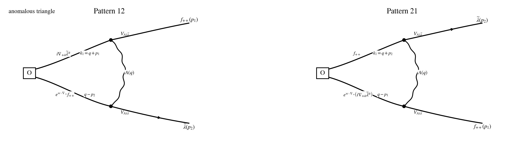

## Step 1: Operator / current / vertex

$$
w\cdot\nabla_+ := w^{+\dot\alpha}\nabla_{+\dot\alpha},
\qquad
w\cdot p_a := w^{+\dot\alpha}p_{a,+\dot\alpha}.
$$

$$
\mathcal O_w^{AB}(p)
:=
\int_{p_1,p_2}
f_{++}^A(p_1)\,
\big(e^{w\cdot\nabla_+}f_{++}^B\big)(p_2)\,
\delta_{p-p_1-p_2}.
$$

## Step 2: Wick contraction

$$
\mathcal I\!\left[Q_1\mathcal O_w^{AB}(p)\right]_{\rm PV,\,1\text{-}loop,\,loc}
=
\Gamma_{12}^{AB}(w)
+
\Gamma_{21}^{AB}(w).
$$

## Step 3: Local part

$$
\Gamma_{12;M}^{(\rm anom)}(w)
=
-2g^2M^2\int_q
e^{\,i w\cdot(p_2-q)}
\frac{(q-p_2)^{+\dot\beta}}
{(q^2+M^2)\big((q+p_1)^2+M^2\big)\big((q-p_2)^2+M^2\big)}\,
\mathscr F_{12}^{\dot\beta},
$$

$$
\Gamma_{21;M}^{(\rm anom)}(w)
=
-2g^2M^2\int_q
e^{\,i w\cdot(p_1-q)}
\frac{(q-p_1)^{+\dot\beta}}
{(q^2+M^2)\big((q+p_2)^2+M^2\big)\big((q-p_1)^2+M^2\big)}\,
\mathscr F_{21}^{\dot\beta}.
$$

## Step 4: Regularization and final local anomaly

$$
Y_{12}:=y\,p_1+(x+y)\,p_2,
\qquad
Y_{21}:=(x+y)\,p_1+y\,p_2.
$$

$$
\mathcal G_{12,+\dot\beta}(w;p_1,p_2)
:=
\int_\Delta e^{\,i w\cdot Y_{12}}\,Y_{12,+\dot\beta},
\qquad
\mathcal G_{21,+\dot\beta}(w;p_1,p_2)
:=
\int_\Delta e^{\,i w\cdot Y_{21}}\,Y_{21,+\dot\beta}.
$$

$$
\boxed{
\mathcal I\!\left[Q_1\mathcal O_w^{AB}(p)\right]_{\rm PV,\,1\text{-}loop,\,loc}
=
-\frac{g^2}{8\pi^2}
\int_{p_1,p_2}\delta_{p-p_1-p_2}
\Big[
\mathcal G_{12,+\dot\beta}(w;p_1,p_2)\,\mathscr F_{12}^{AB,\dot\beta}
+
\mathcal G_{21,+\dot\beta}(w;p_1,p_2)\,\mathscr F_{21}^{AB,\dot\beta}
\Big].
}
$$

$$
\mathbb D_{12,+\dot\beta}(w)
:=
\int_\Delta
e^{\,w\cdot\big(y\nabla_+^{(1)}+(x+y)\nabla_+^{(2)}\big)}
\Big(y\nabla_{+\dot\beta}^{(1)}+(x+y)\nabla_{+\dot\beta}^{(2)}\Big),
$$

$$
\mathbb D_{21,+\dot\beta}(w)
:=
\int_\Delta
e^{\,w\cdot\big((x+y)\nabla_+^{(1)}+y\nabla_+^{(2)}\big)}
\Big((x+y)\nabla_{+\dot\beta}^{(1)}+y\nabla_{+\dot\beta}^{(2)}\Big),
$$

$$
\boxed{
Q_1\mathcal O_w^{AB}(x)\Big|_{\rm PV,\,1\text{-}loop,\,loc}
=
\frac{i g^2}{8\pi^2}\,
f^{CE}{}_{A}f^{DE}{}_{B}
\Big[
\mathbb D_{12,+\dot\beta}(w)\,f_{++}^C(x_1)\widetilde\lambda^{D\dot\beta}(x_2)
+
\mathbb D_{21,+\dot\beta}(w)\,f_{++}^C(x_2)\widetilde\lambda^{D\dot\beta}(x_1)
\Big]_{x_1=x_2=x}.
}
$$

## Step 5: Simplification examples

$$
\mathcal G_{12,+\dot\beta}
=
\frac16(p_1+2p_2)_{+\dot\beta}
+
\frac{i}{12}\,w^{+\dot\theta}\,\Xi_{12,+\dot\theta,+\dot\beta}
+
O(w^2),
$$

$$
\mathcal G_{21,+\dot\beta}
=
\frac16(2p_1+p_2)_{+\dot\beta}
+
\frac{i}{12}\,w^{+\dot\theta}\,\Xi_{21,+\dot\theta,+\dot\beta}
+
O(w^2),
$$

$$
\Xi_{12,+\dot\theta,+\dot\beta}
:=
p_{1,+\dot\theta}p_{1,+\dot\beta}
+
3p_{1,+(\dot\theta}p_{2,+\dot\beta)}
+
3p_{2,+\dot\theta}p_{2,+\dot\beta},
$$

$$
\Xi_{21,+\dot\theta,+\dot\beta}
:=
3p_{1,+\dot\theta}p_{1,+\dot\beta}
+
3p_{1,+(\dot\theta}p_{2,+\dot\beta)}
+
p_{2,+\dot\theta}p_{2,+\dot\beta}.
$$
