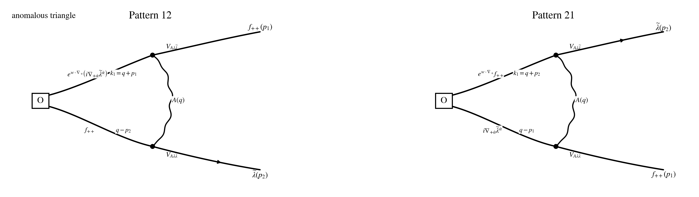

## Step 1: Operator set up

$$
w\cdot\nabla_+ := w^{+\dot\alpha}\nabla_{+\dot\alpha},
\qquad
w\cdot p_a := w^{+\dot\alpha}p_{a,+\dot\alpha}.
$$

$$
\mathcal O_w^{AB}(p)
:=
\int_{p_1,p_2}
\big(e^{w\cdot\nabla_+}f_{++}^A\big)(p_1)\,
f_{++}^B(p_2)\,
\delta_{p-p_1-p_2}.
$$

## Step 2: Act supercharge Q on O (off-shell)

$$
Q\equiv Q_-,
\qquad
Qf_{++}=i\nabla_{+\dot\alpha}\widetilde\lambda^{\dot\alpha}.
$$

$$
Q\mathcal O_w
=
e^{w\cdot\nabla_+}\big(i\nabla_{+\dot\alpha}\widetilde\lambda^{\dot\alpha}\big)\,f_{++}
+
e^{w\cdot\nabla_+}f_{++}\,\big(i\nabla_{+\dot\alpha}\widetilde\lambda^{\dot\alpha}\big).
$$

## Step 3: Subtracting tree level Q

$$
Q_0\mathcal O_w=0.
$$

$$
Q_1\mathcal O_w
=
e^{w\cdot\nabla_+}\big(i\nabla_{+\dot\alpha}\widetilde\lambda^{\dot\alpha}\big)\,f_{++}
+
e^{w\cdot\nabla_+}f_{++}\,\big(i\nabla_{+\dot\alpha}\widetilde\lambda^{\dot\alpha}\big).
$$

## Step 4: All related Feynman Diagrams (Wick contractions) at this order

$$
\mathcal I\!\left[Q_1\mathcal O_w^{AB}(p)\right]_{\rm PV,\,1\text{-}loop,\,loc}
=
\widehat\Gamma_{12}^{AB}(w)
+
\widehat\Gamma_{21}^{AB}(w).
$$

## Step 5: Estimate the Feynman Diagrams

$$
X_{12}:=(x+z)p_1+z p_2,
\qquad
Y_{12}:=y p_1+(x+y)p_2,
$$

$$
X_{21}:=z p_1+(x+z)p_2,
\qquad
Y_{21}:=(x+y)p_1+y p_2.
$$

## Step 6: Do the regularization and Estimate the ultimate result

$$
\widehat{\mathcal G}_{12,+\dot\beta}(w;p_1,p_2)
:=
\int_\Delta e^{\,i w\cdot X_{12}}\,Y_{12,+\dot\beta},
\qquad
\widehat{\mathcal G}_{21,+\dot\beta}(w;p_1,p_2)
:=
\int_\Delta e^{\,i w\cdot X_{21}}\,Y_{21,+\dot\beta}.
$$

$$
\boxed{
\mathcal I\!\left[Q_1\mathcal O_w^{AB}(p)\right]_{\rm PV,\,1\text{-}loop,\,loc}
=
-\frac{g^2}{8\pi^2}
\int_{p_1,p_2}\delta_{p-p_1-p_2}
\Big[
\widehat{\mathcal G}_{12,+\dot\beta}(w;p_1,p_2)\,\mathscr F_{12}^{AB,\dot\beta}
+
\widehat{\mathcal G}_{21,+\dot\beta}(w;p_1,p_2)\,\mathscr F_{21}^{AB,\dot\beta}
\Big].
}
$$

$$
\widehat{\mathbb D}_{12,+\dot\beta}(w)
:=
\int_\Delta
e^{\,w\cdot\big((x+z)\nabla_+^{(1)}+z\nabla_+^{(2)}\big)}
\Big(y\nabla_{+\dot\beta}^{(1)}+(x+y)\nabla_{+\dot\beta}^{(2)}\Big),
$$

$$
\widehat{\mathbb D}_{21,+\dot\beta}(w)
:=
\int_\Delta
e^{\,w\cdot\big(z\nabla_+^{(1)}+(x+z)\nabla_+^{(2)}\big)}
\Big((x+y)\nabla_{+\dot\beta}^{(1)}+y\nabla_{+\dot\beta}^{(2)}\Big).
$$

## Step 7: Simplification examples

$$
\widehat{\mathcal G}_{12,+\dot\beta}(0)=\frac16(p_1+2p_2)_{+\dot\beta},
\qquad
\widehat{\mathcal G}_{21,+\dot\beta}(0)=\frac16(2p_1+p_2)_{+\dot\beta}.
$$
