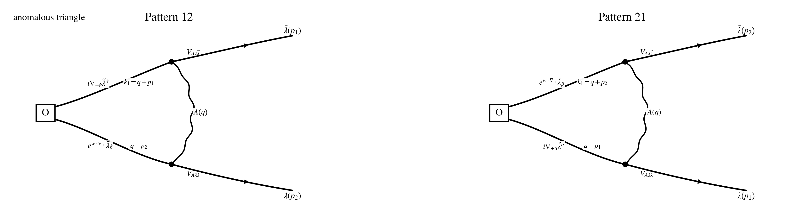

## Step 1: Operator / current / vertex

$$
\boxed{Q_1\equiv Q_-}.
$$

$$
\boxed{\text{same }Q_-\text{ as in }conventions\_and\_rules.md;\ \text{parent }N=4\text{ notation: }Q_-^4.}
$$

$$
\delta_{Q_1}=\delta_{Q_-},
\qquad
J^\mu_{Q_1}=J^\mu_-,
\qquad
\partial_\mu J^\mu_{Q_1}=\partial_\mu J^\mu_-.
$$

$$
w\cdot\nabla_+ := w^{+\dot\alpha}\nabla_{+\dot\alpha},
\qquad
w\cdot p_a := w^{+\dot\alpha}p_{a,+\dot\alpha}.
$$

$$
\mathcal O_{w,\dot\beta}^{AB}(p)
:=
\int_{p_1,p_2}
f_{++}^A(p_1)\,
\big(e^{w\cdot\nabla_+}\bar\lambda_{\dot\beta}^B\big)(p_2)\,
\delta_{p-p_1-p_2}.
$$

## Step 2: Wick contraction

$$
\mathcal I\!\left[Q_1\mathcal O_{w,\dot\beta}^{AB}(p)\right]_{\rm PV,\,1\text{-}loop,\,loc}
=
\Gamma_{12,\dot\beta}^{AB}(w)
+
\Gamma_{21,\dot\beta}^{AB}(w).
$$

## Step 3: Local part

$$
\Gamma_{12;M}^{(\rm anom)}(w)
=
2g^2M^2\int_q
e^{\,i w\cdot(p_2-q)}
\frac{(q-p_2)_{+\dot\beta}}
{(q^2+M^2)\big((q+p_1)^2+M^2\big)\big((q-p_2)^2+M^2\big)}\,
\mathscr C_{12},
$$

$$
\Gamma_{21;M}^{(\rm anom)}(w)
=
2g^2M^2\int_q
e^{\,i w\cdot(p_1-q)}
\frac{(q-p_1)_{+\dot\beta}}
{(q^2+M^2)\big((q+p_2)^2+M^2\big)\big((q-p_1)^2+M^2\big)}\,
\mathscr C_{21}.
$$

## Step 4: Regularization and final local anomaly

$$
Y_{12}:=y\,p_1+(x+y)\,p_2,
\qquad
Y_{21}:=(x+y)\,p_1+y\,p_2.
$$

$$
\mathcal H_{12,+\dot\beta}(w;p_1,p_2)
:=
\int_\Delta e^{\,i w\cdot Y_{12}}\,Y_{12,+\dot\beta},
\qquad
\mathcal H_{21,+\dot\beta}(w;p_1,p_2)
:=
\int_\Delta e^{\,i w\cdot Y_{21}}\,Y_{21,+\dot\beta}.
$$

$$
\boxed{
\mathcal I\!\left[Q_1\mathcal O_{w,\dot\beta}^{AB}(p)\right]_{\rm PV,\,1\text{-}loop,\,loc}
=
-\frac{g^2}{8\pi^2}
\int_{p_1,p_2}\delta_{p-p_1-p_2}
\Big[
\mathcal H_{12,+\dot\beta}(w;p_1,p_2)\,\mathscr C_{12}^{AB}
+
\mathcal H_{21,+\dot\beta}(w;p_1,p_2)\,\mathscr C_{21}^{AB}
\Big].
}
$$

## Step 5: Simplification examples

$$
\mathcal H_{12,+\dot\beta}
=
\frac16(p_1+2p_2)_{+\dot\beta}
+
\frac{i}{12}\,w^{+\dot\theta}\,\Xi_{12,+\dot\theta,+\dot\beta}
+
O(w^2),
$$

$$
\mathcal H_{21,+\dot\beta}
=
\frac16(2p_1+p_2)_{+\dot\beta}
+
\frac{i}{12}\,w^{+\dot\theta}\,\Xi_{21,+\dot\theta,+\dot\beta}
+
O(w^2),
$$

$$
\Xi_{12,+\dot\theta,+\dot\beta}
:=
p_{1,+\dot\theta}p_{1,+\dot\beta}
+
3p_{1,+(\dot\theta}p_{2,+\dot\beta)}
+
3p_{2,+\dot\theta}p_{2,+\dot\beta},
$$

$$
\Xi_{21,+\dot\theta,+\dot\beta}
:=
3p_{1,+\dot\theta}p_{1,+\dot\beta}
+
3p_{1,+(\dot\theta}p_{2,+\dot\beta)}
+
p_{2,+\dot\theta}p_{2,+\dot\beta}.
$$
