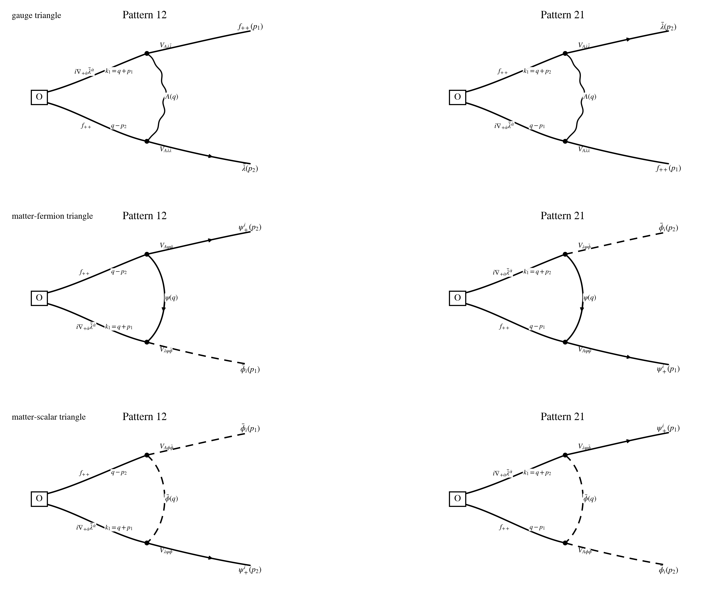

## Step 1: Operator set up

$$
\mathcal O_{ff}^{AB}(p)
:=
\int_{p_1,p_2}
f_{++}^A(p_1)\,
f_{++}^B(p_2)\,
\delta_{p-p_1-p_2},
\qquad
p=p_1+p_2,
$$

$$
p_{12}:=p_{1,+\dot\beta}p_{2,+}{}^{\dot\beta},
$$

$$
\mathscr G_{12}^{AB,\dot\beta}(p_1,p_2)
:=
f^{CE}{}_{A}f^{DE}{}_{B}\,
f_{++}^C(p_1)\bar\lambda^{D\dot\beta}(p_2),
\qquad
\mathscr G_{21}^{AB,\dot\beta}(p_1,p_2):=\mathscr G_{12}^{AB,\dot\beta}(p_2,p_1),
$$

$$
\mathscr M_{12}^{AB}(p_1,p_2)
:=
f^{CE}{}_{A}f^{DE}{}_{B}\,
\bar\phi_i^C(p_1)\psi_+^{iD}(p_2),
\qquad
\mathscr M_{21}^{AB}(p_1,p_2):=\mathscr M_{12}^{AB}(p_2,p_1).
$$

## Step 2: Act supercharge Q on O (off-shell)

$$
Q\equiv Q_-^4,
\qquad
Qf_{++}^A=i\nabla_{+\dot\alpha}\bar\lambda^{A\dot\alpha}.
$$

$$
Q\mathcal O_{ff}^{AB}(p)
=
\int_{p_1,p_2}\delta_{p-p_1-p_2}
\Big[
\big(i\nabla_{+\dot\alpha}\bar\lambda^{A\dot\alpha}\big)(p_1)\,f_{++}^B(p_2)
+
f_{++}^A(p_1)\,\big(i\nabla_{+\dot\alpha}\bar\lambda^{B\dot\alpha}\big)(p_2)
\Big].
$$

## Step 3: Subtracting tree level Q

$$
Q_0\mathcal O_{ff}^{AB}(p)=0.
$$

$$
Q_1\mathcal O_{ff}^{AB}(p)
=
\int_{p_1,p_2}\delta_{p-p_1-p_2}
\Big[
\big(i\nabla_{+\dot\alpha}\bar\lambda^{A\dot\alpha}\big)(p_1)\,f_{++}^B(p_2)
+
f_{++}^A(p_1)\,\big(i\nabla_{+\dot\alpha}\bar\lambda^{B\dot\alpha}\big)(p_2)
\Big].
$$

## Step 4: All related Feynman Diagrams (Wick contractions) at this order

$$
\mathcal I\!\left[Q_1\mathcal O_{ff}^{AB}(p)\right]_{\rm PV,\,1\text{-}loop,\,loc}
=
\Gamma_g^{AB}(p)+\Gamma_{\psi}^{AB}(p)+\Gamma_{\phi}^{AB}(p),
$$

$$
\Gamma_g^{AB}(p)=\Gamma_{12,g}^{AB}(p)+\Gamma_{21,g}^{AB}(p),
\qquad
\Gamma_{\psi}^{AB}(p)=\Gamma_{12,\psi}^{AB}(p)+\Gamma_{21,\psi}^{AB}(p),
\qquad
\Gamma_{\phi}^{AB}(p)=\Gamma_{12,\phi}^{AB}(p)+\Gamma_{21,\phi}^{AB}(p).
$$

## Step 5: Estimate the Feynman Diagrams

$$
\Gamma_{12,g;M}^{AB}(p)
=
2g^2M^2
\int_q
\frac{(q-p_2)_{+\dot\beta}}
{(q^2+M^2)\big((q+p_1)^2+M^2\big)\big((q-p_2)^2+M^2\big)}
\,
\mathscr G_{12}^{AB,\dot\beta},
$$

$$
\Gamma_{21,g;M}^{AB}(p_1,p_2)
:=
\Gamma_{12,g;M}^{AB}(p_2,p_1)\Big|_{\mathscr G_{12}^{AB,\dot\beta}(p_2,p_1)\to\mathscr G_{21}^{AB,\dot\beta}(p_1,p_2)},
$$

$$
\Gamma_{12,\psi;M}^{AB}(p)
=
-\sqrt2\,g^2M^2
\int_q
\frac{q_{+\dot\beta}(q-p_2)_+{}^{\dot\beta}}
{(q^2+M^2)\big((q+p_1)^2+M^2\big)\big((q-p_2)^2+M^2\big)}
\,
\mathscr M_{12}^{AB},
$$

$$
\Gamma_{21,\psi;M}^{AB}(p_1,p_2)
:=
\Gamma_{12,\psi;M}^{AB}(p_2,p_1)\Big|_{\mathscr M_{12}^{AB}(p_2,p_1)\to\mathscr M_{21}^{AB}(p_1,p_2)},
$$

$$
\Gamma_{12,\phi;M}^{AB}(p)
=
-\sqrt2\,g^2M^2
\int_q
\frac{(p_1-q)_{+\dot\beta}(q+p_1)_+{}^{\dot\beta}}
{(q^2+M^2)\big((q+p_1)^2+M^2\big)\big((q-p_2)^2+M^2\big)}
\,
\mathscr M_{12}^{AB},
$$

$$
\Gamma_{21,\phi;M}^{AB}(p_1,p_2)
:=
\Gamma_{12,\phi;M}^{AB}(p_2,p_1)\Big|_{\mathscr M_{12}^{AB}(p_2,p_1)\to\mathscr M_{21}^{AB}(p_1,p_2)}.
$$

## Step 6: Do the regularization and Estimate the ultimate result

$$
\Gamma_{12,g}^{AB,\rm loc}
=
-\frac{g^2}{48\pi^2}(p_1+2p_2)_{+\dot\beta}\,
\mathscr G_{12}^{AB,\dot\beta},
\qquad
\Gamma_{21,g}^{AB,\rm loc}
=
-\frac{g^2}{48\pi^2}(2p_1+p_2)_{+\dot\beta}\,
\mathscr G_{21}^{AB,\dot\beta},
$$

$$
\Gamma_g^{AB,\rm loc}
=
-\frac{g^2}{16\pi^2}
\int_{p_1,p_2}\delta_{p-p_1-p_2}\,
p_{+\dot\beta}\,
\mathscr G_{12}^{AB,\dot\beta},
$$

$$
\Gamma_{12,\psi}^{AB,\rm loc}
=
-\frac{\sqrt2\,g^2}{96\pi^2}\,
p_{12}\,
\mathscr M_{12}^{AB},
\qquad
\Gamma_{21,\psi}^{AB,\rm loc}
=
-\frac{\sqrt2\,g^2}{96\pi^2}\,
p_{12}\,
\mathscr M_{21}^{AB},
$$

$$
\Gamma_{\psi}^{AB,\rm loc}
=
-\frac{\sqrt2\,g^2}{48\pi^2}
\int_{p_1,p_2}\delta_{p-p_1-p_2}\,
p_{12}\,
\mathscr M_{12}^{AB},
$$

$$
\Gamma_{12,\phi}^{AB,\rm loc}
=
-\frac{\sqrt2\,g^2}{48\pi^2}\,
p_{12}\,
\mathscr M_{12}^{AB},
\qquad
\Gamma_{21,\phi}^{AB,\rm loc}
=
-\frac{\sqrt2\,g^2}{48\pi^2}\,
p_{12}\,
\mathscr M_{21}^{AB},
$$

$$
\Gamma_{\phi}^{AB,\rm loc}
=
-\frac{\sqrt2\,g^2}{24\pi^2}
\int_{p_1,p_2}\delta_{p-p_1-p_2}\,
p_{12}\,
\mathscr M_{12}^{AB},
$$

$$
\Gamma_{\rm matter}^{AB,\rm loc}
=
\Gamma_{\psi}^{AB,\rm loc}+\Gamma_{\phi}^{AB,\rm loc}
=
-\frac{\sqrt2\,g^2}{16\pi^2}
\int_{p_1,p_2}\delta_{p-p_1-p_2}\,
p_{12}\,
\mathscr M_{12}^{AB},
$$

$$
\boxed{
\mathcal I\!\left[Q_1\mathcal O_{ff}^{AB}(p)\right]_{\rm PV,\,1\text{-}loop,\,loc}
=
-\frac{g^2}{16\pi^2}
\int_{p_1,p_2}\delta_{p-p_1-p_2}\,
f^{CE}{}_{A}f^{DE}{}_{B}
\Big[
p_{+\dot\beta}\,f_{++}^C(p_1)\bar\lambda^{D\dot\beta}(p_2)
+
\sqrt2\,p_{1,+\dot\beta}p_{2,+}{}^{\dot\beta}\,
\bar\phi_i^C(p_1)\psi_+^{iD}(p_2)
\Big].
}
$$

$$
\boxed{
Q_1\mathcal O_{ff}^{AB}(x)\Big|_{\rm PV,\,1\text{-}loop,\,loc}
=
\frac{g^2}{16\pi^2}\,
i\nabla_{+\dot\beta}
\Big[
f^{CE}{}_{A}f^{DE}{}_{B}
\Big(
f_{++}^C\,\bar\lambda^{D\dot\beta}
+
\sqrt2\,\bar\phi_i^C\,\nabla_+^{\dot\beta}\psi_+^{iD}
\Big)
\Big](x).
}
$$

## Step 7: Simplification examples

$$
\mathcal O_{\rm st}(x):=\operatorname{Tr}(f_{++}f_{++})(x),
\qquad
f^{CE}{}_{A}f^{DE}{}_{A}=C_A\delta^{CD},
\qquad
C_A=N\ \ {\rm for}\ \ SU(N),
$$

$$
\boxed{
Q_1\,\operatorname{Tr}(f_{++}f_{++})(x)\Big|_{\rm PV,\,1\text{-}loop,\,loc}
=
\frac{g^2 C_A}{16\pi^2}\,
i\nabla_{+\dot\beta}\,
\operatorname{Tr}\!\Big(
f_{++}\bar\lambda^{\dot\beta}
+
\sqrt2\,\bar\phi_i\,\nabla_+^{\dot\beta}\psi_+^i
\Big)(x).
}
$$
