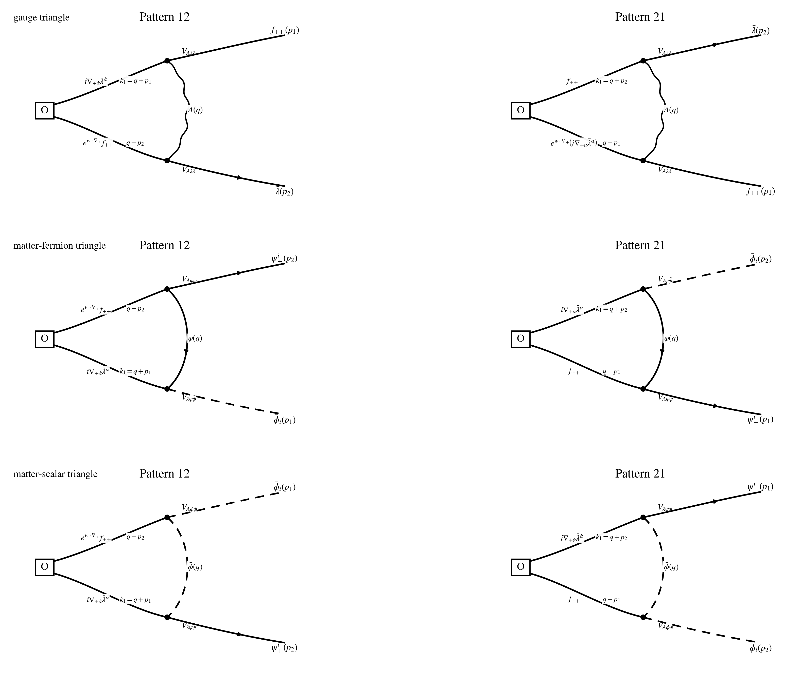

## Step 1: Operator set up

$$
w\cdot\nabla_+:=w^{+\dot\alpha}\nabla_{+\dot\alpha},
\qquad
\mathcal O_w^{AB}(p)
:=
\int_{p_1,p_2}
f_{++}^A(p_1)\,
\big(e^{w\cdot\nabla_+}f_{++}^B\big)(p_2)\,
\delta_{p-p_1-p_2},
$$

$$
p=p_1+p_2,
$$

$$
\mathscr F_{12}^{AB,\dot\beta}(p_1,p_2)
:=
f^{CE}{}_{A}f^{DE}{}_{B}\,
f_{++}^C(p_1)\bar\lambda^{D\dot\beta}(p_2),
\qquad
\mathscr F_{21}^{AB,\dot\beta}(p_1,p_2):=\mathscr F_{12}^{AB,\dot\beta}(p_2,p_1),
$$

$$
\mathscr M_{12}^{AB}(p_1,p_2)
:=
f^{CE}{}_{A}f^{DE}{}_{B}\,
\bar\phi_i^C(p_1)\psi_+^{\,iD}(p_2),
\qquad
\mathscr M_{21}^{AB}(p_1,p_2):=\mathscr M_{12}^{AB}(p_2,p_1).
$$

## Step 2: Act supercharge Q on O (off-shell)

$$
Q\equiv Q_-^4,
\qquad
Qf_{++}=i\nabla_{+\dot\rho}\bar\lambda^{\dot\rho}.
$$

$$
Q\mathcal O_w^{AB}
=
\big(i\nabla_{+\dot\rho}\bar\lambda^{A\dot\rho}\big)e^{\,w\cdot\nabla_+}f_{++}^B
+
f_{++}^A\,e^{\,w\cdot\nabla_+}\big(i\nabla_{+\dot\rho}\bar\lambda^{B\dot\rho}\big).
$$

## Step 3: Subtracting tree level Q

$$
Q_0\mathcal O_w^{AB}=0,
$$

$$
Q_1\mathcal O_w^{AB}
=
\big(i\nabla_{+\dot\rho}\bar\lambda^{A\dot\rho}\big)e^{\,w\cdot\nabla_+}f_{++}^B
+
f_{++}^A\,e^{\,w\cdot\nabla_+}\big(i\nabla_{+\dot\rho}\bar\lambda^{B\dot\rho}\big).
$$

## Step 4: All related Feynman Diagrams (Wick contractions) at this order

$$
\mathcal I\!\left[Q_1\mathcal O_w^{AB}(p)\right]_{\rm PV,\,1\text{-}loop,\,loc}
=
\Gamma_g^{AB}(w)+\Gamma_{\rm matt}^{AB}(w),
$$

$$
\Gamma_{\rm matt}^{AB}(w)=\Gamma_{\psi}^{AB}(w)+\Gamma_{\phi}^{AB}(w).
$$

## Step 5: Estimate the Feynman Diagrams

$$
\Gamma_{12,g;M}^{AB}(w)
=
-2g^2M^2
\int_q
e^{\,i w\cdot(p_2-q)}
\frac{(q-p_2)_{+\dot\beta}}
{(q^2+M^2)\big((q+p_1)^2+M^2\big)\big((q-p_2)^2+M^2\big)}
\,
\mathscr F_{12}^{AB,\dot\beta},
$$

$$
\Gamma_{21,g;M}^{AB}(w)
=
-2g^2M^2
\int_q
e^{\,i w\cdot(p_1-q)}
\frac{(q-p_1)_{+\dot\beta}}
{(q^2+M^2)\big((q+p_2)^2+M^2\big)\big((q-p_1)^2+M^2\big)}
\,
\mathscr F_{21}^{AB,\dot\beta},
$$

$$
\Gamma_{12,\psi;M}^{AB}(w)
=
-\sqrt2\,g^2M^2
\int_q
e^{\,i w\cdot(p_2-q)}
\frac{q_{+\dot\beta}(q-p_2)_+{}^{\dot\beta}}
{(q^2+M^2)\big((q+p_1)^2+M^2\big)\big((q-p_2)^2+M^2\big)}
\,
\mathscr M_{12}^{AB},
$$

$$
\Gamma_{21,\psi;M}^{AB}(w)
:=
\Gamma_{12,\psi;M}^{AB}(w;p_2,p_1)\Big|_{\mathscr M_{12}^{AB}(p_2,p_1)\to\mathscr M_{21}^{AB}(p_1,p_2)},
$$

$$
\Gamma_{12,\phi;M}^{AB}(w)
=
-\sqrt2\,g^2M^2
\int_q
e^{\,i w\cdot(p_1-q)}
\frac{(p_1-q)_{+\dot\beta}(p_1+q)_+{}^{\dot\beta}}
{(q^2+M^2)\big((q+p_2)^2+M^2\big)\big((q-p_1)^2+M^2\big)}
\,
\mathscr M_{12}^{AB},
$$

$$
\Gamma_{21,\phi;M}^{AB}(w)
:=
\Gamma_{12,\phi;M}^{AB}(w;p_2,p_1)\Big|_{\mathscr M_{12}^{AB}(p_2,p_1)\to\mathscr M_{21}^{AB}(p_1,p_2)}.
$$

## Step 6: Do the regularization and Estimate the ultimate result

$$
\mathcal G_{12,+\dot\beta}(w;p_1,p_2)
:=
\int_\Delta e^{\,i w\cdot\big(y p_1+(x+y)p_2\big)}\,
\big(y p_1+(x+y)p_2\big)_{+\dot\beta},
$$

$$
\mathcal G_{21,+\dot\beta}(w;p_1,p_2)
:=
\int_\Delta e^{\,i w\cdot\big((x+y)p_1+y p_2\big)}\,
\big((x+y)p_1+y p_2\big)_{+\dot\beta},
$$

$$
\mathcal H_{12}(w;p_1,p_2)
:=
\int_\Delta y\Big(
e^{\,i w\cdot\big(y p_1+(x+y)p_2\big)}
+
2e^{\,i w\cdot\big((x+y)p_1+y p_2\big)}
\Big),
$$

$$
\mathcal H_{21}(w;p_1,p_2)
:=
\int_\Delta y\Big(
2e^{\,i w\cdot\big(y p_1+(x+y)p_2\big)}
+
e^{\,i w\cdot\big((x+y)p_1+y p_2\big)}
\Big),
$$

$$
\boxed{
\mathcal I\!\left[
Q_1\big(f_{++}^A e^{\,w\cdot\nabla_+}f_{++}^B\big)(p)
\right]_{\rm PV,\,1\text{-}loop,\,loc}
=
-\frac{g^2}{8\pi^2}
\int_{p_1,p_2}\delta_{p-p_1-p_2}
\Big[
\mathcal G_{12,+\dot\beta}(w)\,\mathscr F_{12}^{AB,\dot\beta}
+
\mathcal G_{21,+\dot\beta}(w)\,\mathscr F_{21}^{AB,\dot\beta}
\Big]
}
$$

$$
\boxed{
\qquad\qquad
-\frac{\sqrt2\,g^2}{16\pi^2}
\int_{p_1,p_2}\delta_{p-p_1-p_2}
\Big[
\mathcal H_{12}(w)\,p_{+\dot\beta}p_{2,+}{}^{\dot\beta}\,\mathscr M_{12}^{AB}
+
\mathcal H_{21}(w)\,p_{+\dot\beta}p_{1,+}{}^{\dot\beta}\,\mathscr M_{21}^{AB}
\Big].
}
$$

$$
\nabla_{+\dot\beta}^{(1)}(X_1Y_2):=(\nabla_{+\dot\beta}X_1)Y_2,
\qquad
\nabla_{+\dot\beta}^{(2)}(X_1Y_2):=X_1(\nabla_{+\dot\beta}Y_2),
$$

$$
\mathbb D_{12,+\dot\beta}(w)[X_1Y_2]
:=
\int_\Delta
e^{\,w\cdot\big(y\nabla_+^{(1)}+(x+y)\nabla_+^{(2)}\big)}
\Big(y\nabla_{+\dot\beta}^{(1)}+(x+y)\nabla_{+\dot\beta}^{(2)}\Big)[X_1Y_2],
$$

$$
\mathbb D_{21,+\dot\beta}(w)[X_1Y_2]
:=
\int_\Delta
e^{\,w\cdot\big((x+y)\nabla_+^{(1)}+y\nabla_+^{(2)}\big)}
\Big((x+y)\nabla_{+\dot\beta}^{(1)}+y\nabla_{+\dot\beta}^{(2)}\Big)[X_1Y_2],
$$

$$
\mathbb H_{12}^{\dot\beta}(w)[X_1Y_2]
:=
\int_\Delta y\Big(
e^{\,w\cdot\big(y\nabla_+^{(1)}+(x+y)\nabla_+^{(2)}\big)}
+
2e^{\,w\cdot\big((x+y)\nabla_+^{(1)}+y\nabla_+^{(2)}\big)}
\Big)\,[X_1,\nabla_+^{(2)\dot\beta}Y_2],
$$

$$
\mathbb H_{21}^{\dot\beta}(w)[X_1Y_2]
:=
\int_\Delta y\Big(
2e^{\,w\cdot\big(y\nabla_+^{(1)}+(x+y)\nabla_+^{(2)}\big)}
+
e^{\,w\cdot\big((x+y)\nabla_+^{(1)}+y\nabla_+^{(2)}\big)}
\Big)\,[\nabla_+^{(1)\dot\beta}X_1,Y_2],
$$

$$
\boxed{
Q_1\big(f_{++}^A e^{\,w\cdot\nabla_+}f_{++}^B\big)(x)\Big|_{\rm PV,\,1\text{-}loop,\,loc}
=
\frac{i g^2}{8\pi^2}\,
f^{CE}{}_{A}f^{DE}{}_{B}
\Big[
\mathbb D_{12,+\dot\beta}(w)\big(f_{++}^C(x_1)\bar\lambda^{D\dot\beta}(x_2)\big)
+
\mathbb D_{21,+\dot\beta}(w)\big(f_{++}^C(x_2)\bar\lambda^{D\dot\beta}(x_1)\big)
\Big]_{x_1=x_2=x}
}
$$

$$
\boxed{
\qquad\qquad
+\frac{i\sqrt2\,g^2}{16\pi^2}\,
\nabla_{+\dot\beta}\,
f^{CE}{}_{A}f^{DE}{}_{B}
\Big[
\mathbb H_{12}^{\dot\beta}(w)\big(\bar\phi_i^C(x_1)\psi_+^{\,iD}(x_2)\big)
+
\mathbb H_{21}^{\dot\beta}(w)\big(\bar\phi_i^C(x_2)\psi_+^{\,iD}(x_1)\big)
\Big]_{x_1=x_2=x}.
}
$$

## Step 7: Simplification examples

$$
\mathcal G_{12,+\dot\beta}(0)=\frac16(p_1+2p_2)_{+\dot\beta},
\qquad
\mathcal G_{21,+\dot\beta}(0)=\frac16(2p_1+p_2)_{+\dot\beta},
$$

$$
\mathcal H_{12}(0)=\mathcal H_{21}(0)=\frac12,
$$

$$
\boxed{
Q_1\big(f_{++}^A f_{++}^B\big)(x)\Big|_{\rm PV,\,1\text{-}loop,\,loc}
=
\frac{g^2}{16\pi^2}\,
i\nabla_{+\dot\beta}\,
f^{CE}{}_{A}f^{DE}{}_{B}
\Big(
f_{++}^C\,\bar\lambda^{D\dot\beta}
+
\sqrt2\,\bar\phi_i^C\,\nabla_+^{\dot\beta}\psi_+^{\,iD}
\Big)(x).
}
$$
